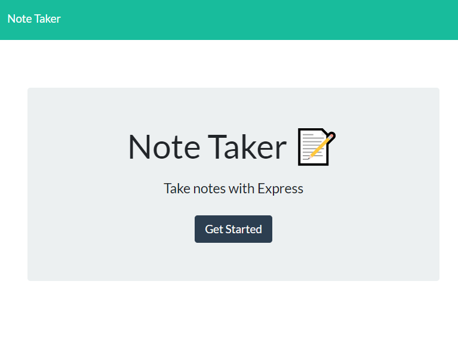
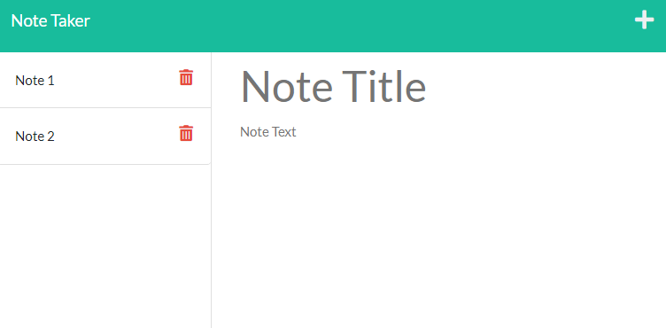

    
# Team Profile Generator

    
## Description
    
The application allows the user to add and delete notes.

## Table of Contents 

* [Installation](#installation)

* [Usage](#usage)

* [Screenshot](#screenshots)

* [Deployed Version](#Deployment)

* [Questions](#questions)

## Installation
    
'npm i' to install the necessary dependencies.
    
## Usage
    

When the user adds a note, the note is added to the end of the list.

When the user deletes a note, the note is deleted from the list.

When the user selects a note, the note is displayed.

When the user presses the plus sign, an new note screen is displayed (if the user weas already viewing another note).

## Screenshots

))

## Deployment

[Deployed Version](https://calm-headland-94675.herokuapp.com/)
   
## License
    
This project is licenced under MIT

## Questions

[More of my work can be found here](https://github.com/ChrisAylen)
    
